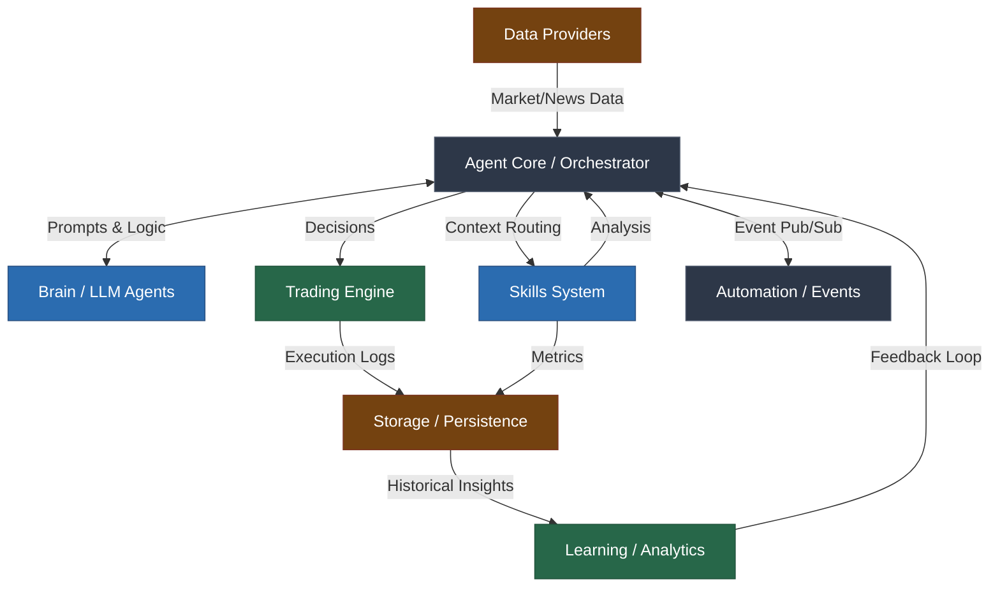
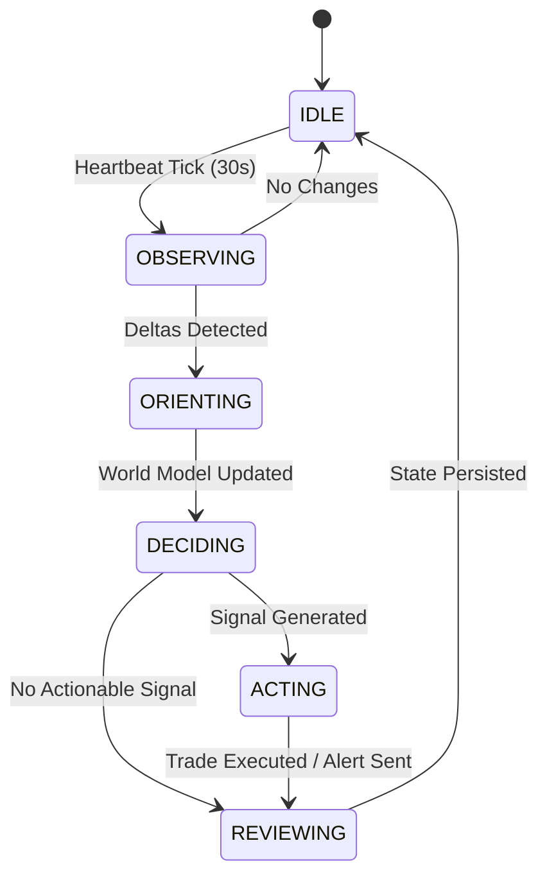
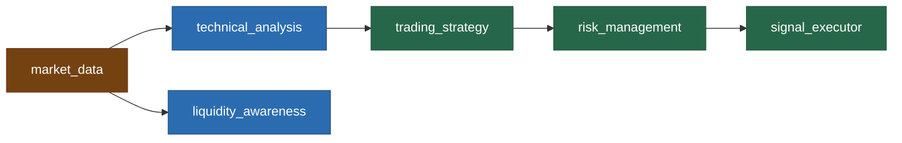

# EuroScope Architecture Reference (Part 1)

This document provides a comprehensive overview of the EuroScope v5.0.0 architecture, detailing the system flow, component dependencies, and cognitive structure.

## 1. System Overview

EuroScope is built on a highly modular, decoupled architecture. At its core, the system acts as an autonomous agent operating within an OODA loop (Observe, Orient, Decide, Act), supported by discrete, unidirectional components.

### 1.1 High-Level Component Interactions

The following diagram illustrates the interaction between the primary domains of the system:

### 1.2 Dependency Injection Container (`container.py`)

To eliminate circular dependencies and ensure a deterministic startup sequence, EuroScope implements a central `ServiceContainer`. Dependencies are instantiated in six strict topological layers:

1. **Base Infrastructure:** Database engine (SQLAlchemy/SQLite), EventBus, SmartAlerts, SkillsRegistry, RateLimiter.
2. **Core Brain Components:** Memory, VectorMemory, Orchestrator, LLMRouter.
3. **Intelligence Layers:** LLMInterface (Agent), Forecaster.
4. **Domain & Data Services:** MultiSourceProvider, CapitalProvider (Broker), NewsEngine, EconomicCalendar, FundamentalDataProvider, RiskManager.
5. **Tracking & Analytics:** PatternTracker, AdaptiveTuner, EvolutionTracker, DailyTracker, BriefingEngine.
6. **User Management & Notifications:** UserSettings, NotificationManager, WorkspaceManager.

### 1.3 The Cognitive Loop (OODA)

The system operates autonomously via a 30-second `HeartbeatService` that triggers the Agent Core's OODA loop state machine:

## 2. Skills Architecture

The EuroScope "Skills" framework allows the agent to interact with internal engines and external data sources using self-documenting, independent modules.

### 2.1 Topological Dependency Graph (DAG)

Skills often require data from other skills. The `SkillsRegistry` enforces a strict topological execution order.

### 2.2 Skill Lifecycle and Data Flow

1. **`BaseSkill` Definition:** Every skill extends `BaseSkill` and defines its metadata (`name`, `capabilities`, `category`).
2. **Discovery:** `SkillsRegistry.discover()` scans the `euroscope/skills/` directory, loading any module that contains a valid `SKILL.md` and `skill.py`.
3. **Context Passing:** The `SkillContext` object acts as a localized data bus. As skills execute, they mutate specific namespaces within the context (e.g., `ctx.market_data`, `ctx.analysis`, `ctx.signals`).
4. **Execution Safety:** The orchestrator invokes skills via `safe_execute()`. This wrapper intercepts all exceptions, applies an execution timeout (default 30s), and guarantees a standardized `SkillResult` is returned, preventing any single skill failure from crashing the pipeline.

## 3. Pipeline Data Flow

The full analysis pipeline (
un_full_analysis_pipeline) chains multiple skills together to form a coherent trading thesis. The SkillContext acts as the data bus throughout this process.

### 3.1 Execution Sequence

`mermaid
sequenceDiagram
    participant O as Orchestrator
    participant S1 as session_context
    participant M as market_data
    participant T as technical_analysis
    participant S2 as trading_strategy
    participant R as risk_management

    O->>S1: run_skill('detect')
    S1-->>O: populates ctx.metadata['session_regime']
    
    O->>M: run_skill('get_candles')
    M-->>O: populates ctx.market_data['candles']
    
    O->>T: run_skill('full')
    T-->>O: populates ctx.analysis['indicators']
    
    O->>S2: run_skill('detect_signal')
    S2-->>O: populates ctx.signals['direction']
    
    O->>R: run_skill('assess_trade')
    R-->>O: populates ctx.risk['approved']
`

## 4. Conflict Arbiter

The ConflictArbiter is responsible for synthesizing a final decision when multiple analytical skills provide contradictory signals (e.g., technical analysis is BULLISH, but fundamental analysis is BEARISH).

### 4.1 Weighting and Resolution

The Arbiter applies dynamic weights to skill outputs based on the current market regime and session:
- **Asian Session:** pattern_detection weight is reduced to 0.6x; 	echnical_analysis to 0.8x.
- **London Overlap:** 	echnical_analysis weight is increased to 1.2x; pattern_detection to 1.1x.
- **Trending Regime:** 	echnical_analysis weight is increased to 1.3x.
- **Ranging Regime:** pattern_detection weight is reduced to 0.5x.

### 4.2 Multi-Agent Deliberation Escallation

If the resulting synthesis has a very low confidence (< 0.45) or a high conflict ratio (> 25% opposition), the Arbiter escalates the decision to the **Multi-Agent Deliberation Committee** (via LLMRouter), triggering a debate between specialized LLM personas to find a consensus.

### 4.3 Data Quality Penalties

Before the final verdict is accepted, the Orchestrator applies a confidence penalty via _calculate_final_confidence() if data quality is degraded:
- **Partial Data:** 20% penalty.
- **Minimal Data:** 50% penalty.

## 5. Emergency Mode

The system implements a robust circuit breaker pattern via the deviation_monitor and safety_guardrails.

### 5.1 Activation Path

1. deviation_monitor detects extreme anomalies (e.g., flash crash).
2. It sets ctx.metadata['emergency_mode'] = True and an emergency_until timestamp.
3. The Orchestrator's pipeline short-circuits: trading skills are completely skipped.
4. Alerts are temporarily suppressed via SmartAlerts.suppress() to prevent spam during the event.
5. The crisis_analysis skill (if available) is invoked to assess the market structure damage.
