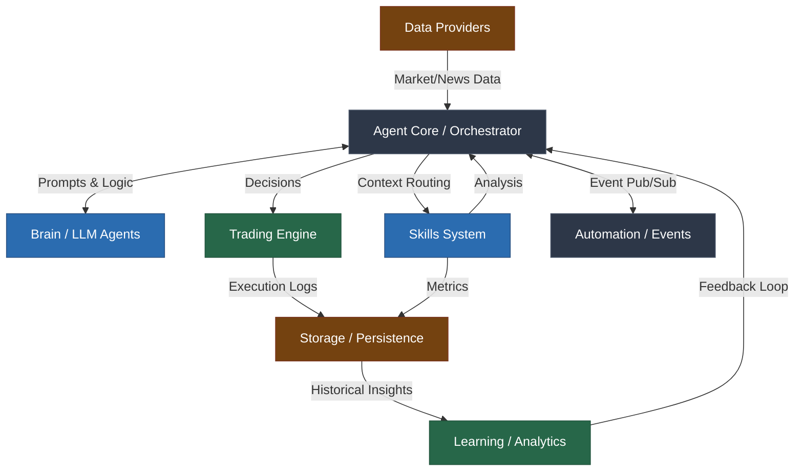
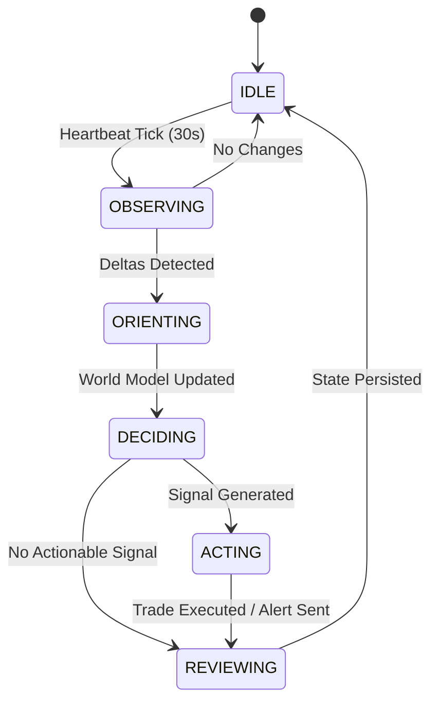
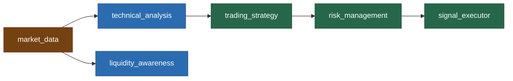

# EuroScope Architecture Reference (Part 1)

This document provides a comprehensive overview of the EuroScope v5.0.0 architecture, detailing the system flow, component dependencies, and cognitive structure.

## 1. System Overview

EuroScope is built on a highly modular, decoupled architecture. At its core, the system acts as an autonomous agent operating within an OODA loop (Observe, Orient, Decide, Act), supported by discrete, unidirectional components.

### 1.1 High-Level Component Interactions

The following diagram illustrates the interaction between the primary domains of the system:

### 1.2 Dependency Injection Container (`container.py`)

To eliminate circular dependencies and ensure a deterministic startup sequence, EuroScope implements a central `ServiceContainer`. Dependencies are instantiated in six strict topological layers:

1. **Base Infrastructure:** Database engine (SQLAlchemy/SQLite), EventBus, SmartAlerts, SkillsRegistry, RateLimiter.
2. **Core Brain Components:** Memory, VectorMemory, Orchestrator, LLMRouter.
3. **Intelligence Layers:** LLMInterface (Agent), Forecaster.
4. **Domain & Data Services:** MultiSourceProvider, CapitalProvider (Broker), NewsEngine, EconomicCalendar, FundamentalDataProvider, RiskManager.
5. **Tracking & Analytics:** PatternTracker, AdaptiveTuner, EvolutionTracker, DailyTracker, BriefingEngine.
6. **User Management & Notifications:** UserSettings, NotificationManager, WorkspaceManager.

### 1.3 The Cognitive Loop (OODA)

The system operates autonomously via a 30-second `HeartbeatService` that triggers the Agent Core's OODA loop state machine:

## 2. Skills Architecture

The EuroScope "Skills" framework allows the agent to interact with internal engines and external data sources using self-documenting, independent modules.

### 2.1 Topological Dependency Graph (DAG)

Skills often require data from other skills. The `SkillsRegistry` enforces a strict topological execution order.

### 2.2 Skill Lifecycle and Data Flow

1. **`BaseSkill` Definition:** Every skill extends `BaseSkill` and defines its metadata (`name`, `capabilities`, `category`).
2. **Discovery:** `SkillsRegistry.discover()` scans the `euroscope/skills/` directory, loading any module that contains a valid `SKILL.md` and `skill.py`.
3. **Context Passing:** The `SkillContext` object acts as a localized data bus. As skills execute, they mutate specific namespaces within the context (e.g., `ctx.market_data`, `ctx.analysis`, `ctx.signals`).
4. **Execution Safety:** The orchestrator invokes skills via `safe_execute()`. This wrapper intercepts all exceptions, applies an execution timeout (default 30s), and guarantees a standardized `SkillResult` is returned, preventing any single skill failure from crashing the pipeline.
