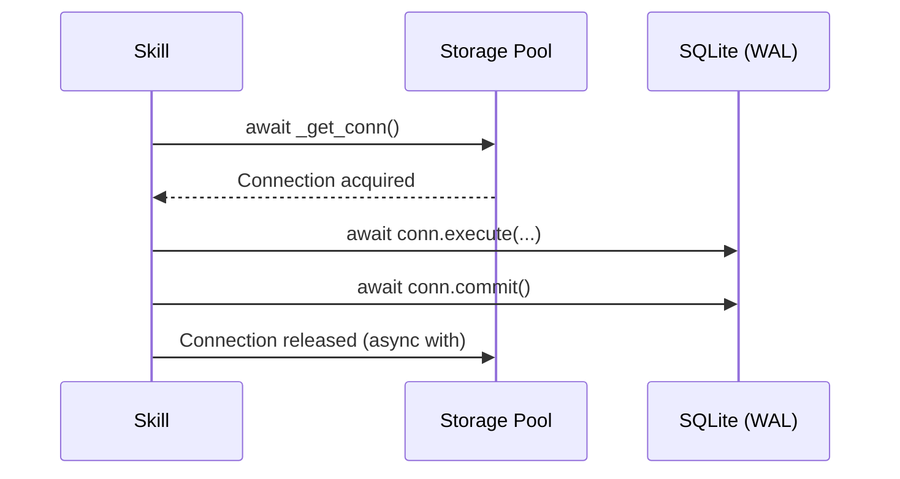

# Storage Layer Documentation

EuroScope currently utilizes an async SQLite database (`aiosqlite`) with WAL (Write-Ahead Logging) mode enabled to ensure non-blocking, highly concurrent I/O performance. This document outlines the storage contracts, Connection Pool mechanics, and the planned migration path to PostgreSQL.

## 1. Storage Contracts & Schema

The database is initialized synchronously at startup, generating the following critical tables:

### 1.1 Trading & Analytics Tables

| Table | Purpose | Key Columns | JSON Fields |
|:---|:---|:---|:---|
| `predictions` | Stores LLM directional forecasts before they are resolved. | `timeframe`, `direction`, `confidence`, `accuracy_score` | - |
| `trading_signals` | Deterministic trading signals generated by the Strategy Engine. | `direction`, `entry_price`, `stop_loss`, `status` | - |
| `trade_journal` | Comprehensive log of executed trades including context at entry. | `pnl_pips`, `is_win`, `regime`, `confidence` | `indicators_snapshot`, `patterns_snapshot` |
| `performance_metrics` | Aggregated snapshots of strategy performance (Sharpe, Drawdown). | `win_rate`, `sharpe_ratio`, `max_drawdown_pips` | - |
| `pattern_stats` | Tracks historical success rates of specific chart patterns. | `pattern_name`, `is_success`, `causal_chain` | - |
| `learning_insights` | Mathematical insights derived from closed trade counterfactuals. | `accuracy`, `timestamp` | `factors`, `recommendations` |

### 1.2 System & User Tables

| Table | Purpose | Key Columns |
|:---|:---|:---|
| `transaction_logs` | Write-Ahead Log (WAL) for discrete system state transitions. | `action`, `payload`, `status` |
| `alerts` | Smart notifications bound to price/indicator conditions. | `condition`, `target_value`, `triggered` |
| `market_notes` / `news_events` | Fundamental intelligence and macroeconomic headlines. | `impact_score`, `sentiment_score` |
| `memory` | Simple Key-Value store for arbitrary state strings. | `key`, `value` |
| `user_preferences` | Bot configurations mapped to Telegram `chat_id`. | `risk_tolerance`, `max_signals_per_day` |

## 2. Connection Pool and WAL

To handle the high frequency of reads (Agent OODA loops) and writes (tick updates), `Storage` utilizes a custom connection pool:
- **Pool Size:** 5 concurrent asynchronous SQLite connections.
- **Queueing:** Connections are requested via `await self._get_conn()` and released back to the `asyncio.Queue` via an async context manager (`async with`).
- **WAL Mode:** Write-Ahead Logging allows simultaneous readers and writers. `PRAGMA synchronous=NORMAL` maximizes write speed while preserving ACID compliance.



## 3. Transaction WAL (Write-Ahead Log)

For critical operations (e.g., executing a trade), EuroScope employs a secondary application-level WAL via `transaction_logs`.

1. **Log:** `log_transaction(action, payload)` writes the intent (status='pending').
2. **Execute:** The API call or Broker command fires.
3. **Commit:** `update_transaction_status(id, 'completed')` marks it safe.

If the VPS crashes between Step 2 and 3, upon reboot, EuroScope queries `status='pending'` to reconcile stranded capital/orders.

## 4. PostgreSQL Migration Path

As the agent scales (e.g., adding Capital.com WS tick data), raw SQLite single-file locks will become a bottleneck. The migration path to `SQLAlchemy 2.0` (Async) is already mapped.

### 4.1 Schema Mapping Equivalencies
- `INTEGER PRIMARY KEY AUTOINCREMENT` → `SERIAL PRIMARY KEY`
- SQLite `TEXT` (JSON) → Native Postgres `JSONB` for optimized indexing:
  ```sql
  -- Postgres JSONB Querying
  SELECT * FROM trade_journal WHERE indicators_snapshot->'RSI'->>'value' > '70';
  ```

### 4.2 SQLAlchemy Abstraction
Phase 1 is already implemented via `euroscope.data.db.alchemy_storage.SQLAlchemyStorage`. By specifying a valid `EUROSCOPE_DATABASE_URL` (e.g., `postgresql+asyncpg://`), `container.py` will automatically swap the legacy raw-SQLite layer for the enterprise SQLAlchemy engine.

### 4.3 Data Migration (ETL)
To migrate existing data to PostgreSQL:
1. Initialize `alembic init alembic` to generate migration scripts.
2. Run an ETL script to batch insert `data/euroscope.db` rows into the remote PostgreSQL instance, casting boolean `INTEGER` values to native `BOOLEAN`.
